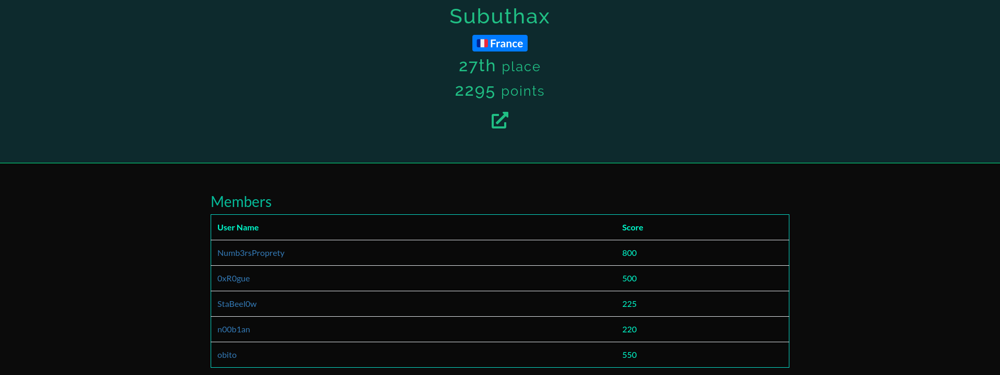
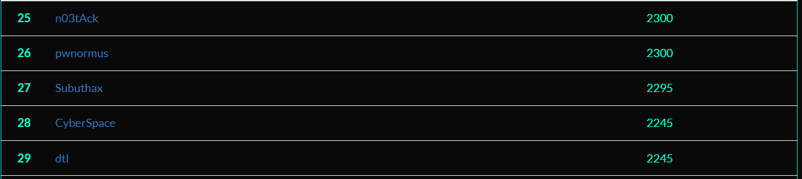

# BDSecCTF

## Contexte
CTF Jeopardy donc plusieurs catégories (WEB, CRYPTO et etc )

## Règles
- Temps: 24h (07/20/22 17h - 07/21/22 17h (UTC+2) )
- Maximum par équipe : 5

## Results
 Team Subuthax - 27/542

## Challenges
- [x] -> Done  
- [ ] -> Not Done

- Steganography
  - [ ] Sound's Good
  - [ ] Deep Dive Into It !!
  
- PWN
  - [x] PwnRace
  
- Reverse Engineering
  - [ ] BDSec License Checker 0x1
  - [ ] shashdot
  - [x] Flag Box
  - [x] Simple Math
  - [x] Poster
  - [ ] BDSec License Checker 0x02
  - [ ] BDSec License Checker 0x03
 
- Cryptography
  - [x] CryptoCode
  - [x] VIPx01
  - [ ] VIPx02
  - [x] Fake
  - [ ] Dominoes
  - [ ] Loop Lover
  - [x] Basically RSA
 
- Web
  - [x] Jungle Templating
  - [x] Awesome Note Keeping
  - [x] Knight Squad Shop
 
- Programming
  - [x] Find the Cost
 
- OSINT
  - [x] Find the Masterpiece
  - [x] Find Rejvi
  
- Misc
  - [x] Message of Hufflepuff
  - [x] Find Me Inside
 
- Networking
  - [x] Victim & Attacker
  - [x] Which FTP ?
  - [x] FTP Creads
  - [x] Uploaded File
  - [x] Log File
  - [x] Project Incharge
  - [x] Looooong Looooong
  - [x] Administrator
  - [x] Shell
  - [x] Secret Key
  - [x] Database Admin
  - [x] HostName
  - [x] CodeName
  - [x] Server Info
  - [x] Service Exploit
  - [x] Exploit Exploit Exploit
  - [x] Vulnerable Service
  - [x] msg.txt
  - [x] Attacker
  - [x] Server User's
 
 
  
